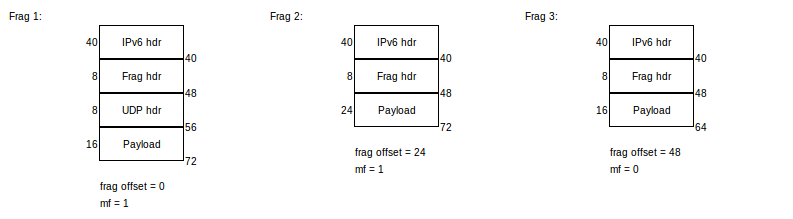

# defrag

Análisis más a fondo de defrag4 y defrag6.

## Comportamiento común

Salvo las variaciones mencionadas abajo, tres de las cuatro variantes de defrag se comportan de la siguiente manera:

- Solamente se fetchea el primer fragmento al stack de módulos de Netfilter. El resto de ellos se guarda en una lista contenida en el skb.
	- Nótese que esta lista no contiene al primer fragmento.
- Los fragmentos se ordenan.
	- Creo que es una excusa razonable para violar ese SHOULD ("The translator SHOULD make sure that the packets belonging to the same flow leave the translator in the same order in which they arrived").
		- ¿Realmente lo vamos a violar? la cita dice "packets", no "fragments".
- Los fragmentos se tratan como páginas y defrag se esfuerza por engañar al stack, haciéndolo pensar que solamente está viendo un solo paquete.
	- En IPv6, en el primer fragmento
		- el fragment header se erradica (y esto es reflejado en el campo Next Header del header anterior).
			- ¿Qué hay de los otros extension headers?
				- Esto realmente no importa porque el RFC nos pide que los ignoremos.
		- Payload length ahora también abarca al payload del resto de los fragmentos.
	- En IPv4, en el primer fragmento
		- DF es apagado (wtf why?).
		- MF es apagado.
		- Total Length ahora también abarca al payload del resto de los fragmentos.
		- No sé si se actualiza el checksum.
	- `skb->len` ahora también abarca el payload del resto de los fragmentos.
- En el resto de los fragmentos
	- `skb->data` apunta al payload.
		- O quizá al header siguiente del fragment header (en IPv6).
	- Sin embargo, todavía es posible acceder al header de capa 3 mediante `skb_network_header()`.
		- En IPv6, `skb_transport_header()` apunta al fragment header.
		- En IPv4, `skb_transport_header()` apunta al header de capa 3.
	- Quizá podemos en Jool quitar `skb_jcb(skb)->payload` y reemplazarlo por `skb->data`, siguiendo el ejemplo
		- Realmente no tiene importancia porque no estamos apretados con el control buffer.
	- Si existe (ie se está usando `frag_list` en lugar de `frags`), `skb->len` solamente abarca al payload.

Por ejemplo, si envío estos tres fragmentos de un mismo paquete:

defrag6 los pervierte en esto:

("nh" es `skb_network_header()` y "th" es `skb_transport_header()`.)

## IPv6 - kernels 3.13+

Guarda los fragmentos en la lista `skb_shinfo(skb)->frag_list`. `frags` siempre está vacío.

Cuando Linux arroja al paquete hacia la red, todo el hack es revertido (excepto el orden de los fragmentos) y Wireshark observa los tres fragmentos originales (en orden). Esto es a menos de que algún módulo linearice al paquete, en cuyo caso los fragmentos se fusionan irrevertiblemente (Wireshark solamente ve un paquete).

## IPv4 - kernels 3.12-

Guarda los fragmentos en la lista `skb_shinfo(skb)->frag_list`. `frags` siempre está vacío.

Linux junta los fragmentos antes de arrojarlos hacia la red. DF se pierde; el paquete resultante siempre lo tiene en cero (lo cual es un desastre). Linearizar no afecta al resultado.

## IPv4 - kernels 3.13+

Guarda los fragmentos en la lista `skb_shinfo(skb)->frags`. `frag_list` siempre está vacío.

Linux junta los fragmentos antes de arrojarlos hacia la red. DF no se pierde (por lo tanto, al parecer no está considerando que lleguen fragmentos con DF encendido). Linearizar no afecta al resultado.

## IPv6 - kernels 3.12-

Este es la excepción. Se comporta completamente diferente a los anteriores.

Esto es lo que escupe defrag6 cuando le llegan fragmentos:

- Los fragmentos se ordenan.
- Se fetchea cada fragmento por separado. Como ya llegaron todos, se fetchean rápido y seguido.
	- Aunque lleguen el primer y último fragmento (y por lo tanto toda la info necesaria está a la mano), se espera a que lleguen los otros para fetchear.
- `skb_shinfo(skb)->frag_list` siempre está vacío. Aparentemente solo está contemplado en IPv4.
- `skb_shinfo(skb)->frags` siempre está vacío.
- La información contenida dentro de los fragmentos (headers, payload) no es editada.

En la máquina destino, Wireshark observa los tres fragmentos originales, en orden. Linearizar no afecta al resultado.

Vamos a tener que mantener la fragment database para estos kernels. Lo bueno es que podemos simplificarla bastante.

