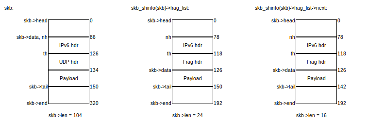

# defrag

Análisis más a fondo de defrag4 y defrag6.

## IPv6 - kernels 3.13+

Esto es lo que escupe defrag6 cuando le llegan fragmentos:

- Solamente se fetchea el primer fragmento. El resto de ellos se guarda en `skb_shinfo(skb)->frag_list` (donde `skb` es el primer fragmento).
	- Nótese que esta lista no contiene al primer fragmento.
- Los fragmentos se ordenan.
	- Creo que es una excusa razonable para violar ese SHOULD ("The translator SHOULD make sure that the packets belonging to the same flow leave the translator in the same order in which they arrived").
		- ¿Realmente lo vamos a violar? la cita dice "packets", no "fragments".
- El fragment header del primer fragmento es erradicado.
	- La pérdida de este header no es tan problemática ya que es completamente re-inferible.
	- ¿Qué hay de los otros extension headers?
		- Esto realmente no importa porque el RFC nos pide que los ignoremos.
- Se cambia información en el header de IPv6:
	- El nexthdr refleja la ausencia del fragment header.
	- Payload length ahora también abarca el payload del resto de los fragmentos.
	- En otras palabras, se recupera el header antes de la fragmentación.
	- `skb->len` ahora también abarca el payload del resto de los fragmentos.
		- Lo cual demanda que re-definamos lo que esperamos de esta variable...
- `skb->data` en el resto de los fragmentos apunta al payload.
	- O quizá al header siguiente del fragment header.
	- Sin embargo, todavía es posible acceder al header de capa 3 mediante `skb_network_header()`. `skb_transport_header()` apunta al fragment header.
	- Quizá podemos en Jool quitar `skb_jcb(skb)->payload` y reemplazarlo por `skb->data`, siguiendo el ejemplo (Realmente no tiene mucha importancia).
	- `skb->len` solamente abarca al payload.

Por ejemplo, si envío estos tres fragmentos de un mismo paquete:

defrag6 los pervierte en esto:

("nh" es `skb_network_header()` y "th" es `skb_transport_header()`.)

